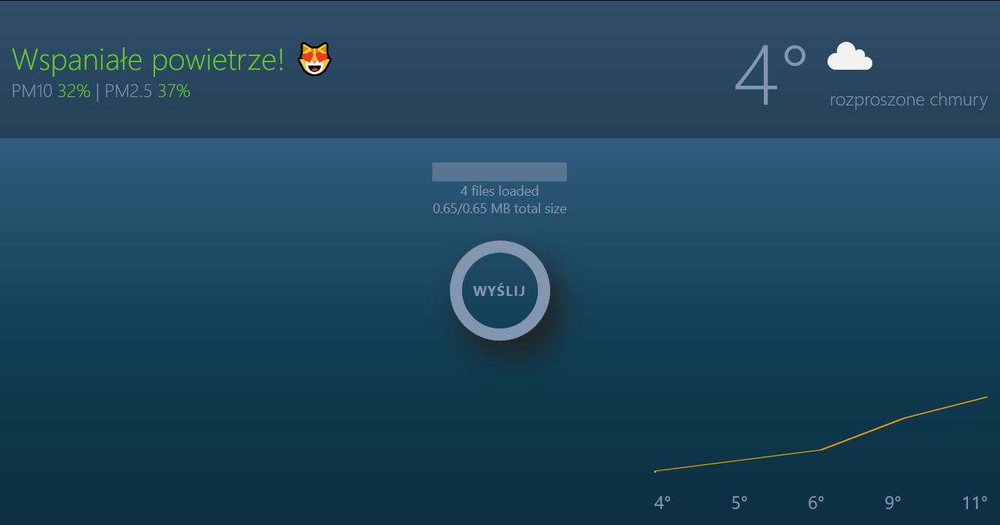

# home_file_server
Backup your files on home network server using web app client.
It will keep uploaded directory strucure 

 
<b>Tech stack: </b>  
Client: React, Redux, Sass 
Server: Node.js, Express  

<b>INSATLL</b> 
There are 2 separate package.json files for server and client
<code>npm install</code> in both <code> ./ and ./client </code>

<b>development server</b> on localhost:3000  
<code> npm run dev </code> 

<b>production</b>  
server will serve static files from <code>./client/build</code>  
<code> npm run build</code>  
